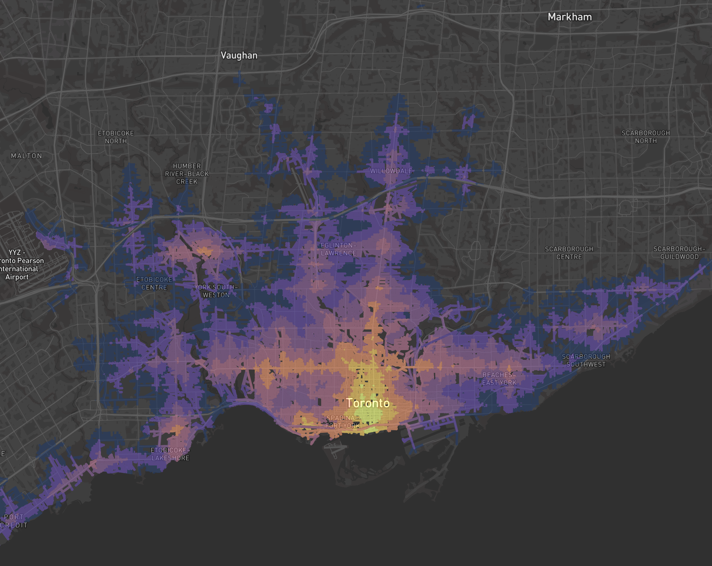

# Time To Reach - Transit Travel-time Map

It's a travel-time map for public transit that shows which areas of the city are most accessible by public transit.

I built this while trying to look for housing in Toronto. I found myself going back and forth on Google Maps trying to compare which locations have a shorter commute via transit. I completed this project long after I found a place, but hopefully it helps someone else.


# How it works

The app consists of a Rust backend which queries the transit schedule data (in GTFS format) and a React frontend which displays the map and colors each road segment according to how long it takes to reach that segment from the origin.

## Generating times to reach for each road

The backend uses heuristics-based BFS search on each trip from the origin. At all stops along that trip (`time_to_reach.rs:all_stops_along_trip()`),
we "disembark" and see what other routes we can take from that stop (`time_to_reach.rs:explore_from_point()`). For each possible
new route, we do the same thing: get on and along all stops, see what other new connections can be made.

There are some heuristics to make each query faster:
 - We only get off a stop if we haven't reached that stop before (or we have reached it before but at a *worse time*). 
 - Rather than using a queue like in traditional BFS, we prioritize exploring train/subway routes first, as they are faster and result in less work.


## Rendering the tiles

I used an approach similar to how Google Maps displays traffic congestion (red, yellow, green). I used the Python library 
OSMnx (`download_gpkg.py:generate_geopackage_all_cities`) to download road vectors from OpenStreetMaps and loaded them into 
a PostGIS database. 

Using Mapbox's vector tile sources and Expressions feature, I could color these road segments based on their ID:

```typescript
map.setPaintProperty("transit-layer", "line-color",
    ["get", ["to-string", ["id"]], ["literal", timeToReachData]],
);
```

`timeToReachData` converts road segment IDs to a color, based on how long it takes to reach that segment.

## Drawing paths

When you hover over any particular point, the app draws the path from the origin. The path shows you which buses or trains to take. 
We cache the results of the BFS search as a tree of individual vehicle trips. For example, if all destinations require you to take 
the Line 1 Subway, we only store that trip once. If a trip is a transfer from a previous trip, we store the Id of the parent trip
in `InProcessTrip.previous_transfer` (`in_progress_trip.rs`).

When you hover over a point, we simply traverse the tree backwards via the `previous_transfer` pointer until we reach the origin.

This approach requires very little memory to store all the possible trips and their paths from the origin. Since these trips are immutable,
we store them inside an `Arena` to avoid lifetime problems. Since Arenas store trips contiguously, we also don't experience
memory fragmentation problems that come with large trees. Freeing the memory of the tree is also incredibly performant, as 
we just clear the memory of the Arena.
